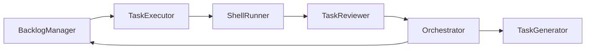

# Cadence Dev-Orchestrator — Quick Start

> *Five minutes to turn your terminal or notebook into a mini-IDE for Cadence.*

## Install (optional eye-candy)
    pip install rich prompt_toolkit

## CLI Cheat-Sheet
| Action                | Command                                                   | OOP/Agent Role      |
|-----------------------|-----------------------------------------------------------|---------------------|
| View open micro-tasks | `python -m cadence.dev.orchestrator backlog`               | BacklogManager      |
| Generate micro-tasks  | `python -m cadence.dev.orchestrator generate --mode micro` | TaskGenerator       |
| Patch loop            | `python -m cadence.dev.orchestrator start`                 | TaskExecutor        |
| Run tests/review      | `python -m cadence.dev.orchestrator evaluate`              | ShellRunner/Reviewer|
| Commit & record done  | `python -m cadence.dev.orchestrator done`                  | Archive/Orchestrator|
| (All via orchestrator)|                                                           |                     |

*See internal docs for full agent/class mapping and extension points!*

---

## Modes

### Execution Modes
| Mode            | Command                            | Risk Surface |
|-----------------|------------------------------------|--------------|
| safe_inmemory   | `python mvp_loop.py`               | ZERO (no shell, no disk) |
| full_shell      | `python -m cadence.dev.orchestrator start` | MEDIUM (git, shell, pytest) |

---

## Notebook Flow
```python
from cadence.dev.orchestrator import DevOrchestrator
orch = DevOrchestrator()
orch.show()          # backlog overview
orch.run_task_cycle()
```

---
## Conceptual Agent/OOP Pipeline



**All commands route through the Orchestrator**, which calls the appropriate role (class). Each role matches to a single responsibility in the dev pipeline and can be upgraded/swapped for an LLM agent or external service. Every step logs its state.


## Troubleshooting

| Symptom             | Hint                                                      |
| ------------------- | --------------------------------------------------------- |
| Plain text headings | `rich` not installed — fine, just less colourful.         |
| LLM auth error      | Export `AZURE_OPENAI_*` vars or create `config/llm.json`. |
| Patch rejects       | File already exists — delete or commit first, retry.      |
| Tests fail          | Fix code or regenerate diff via `task`, then rerun.       |

---

© 2025 Cadence Project — personal developer tooling.