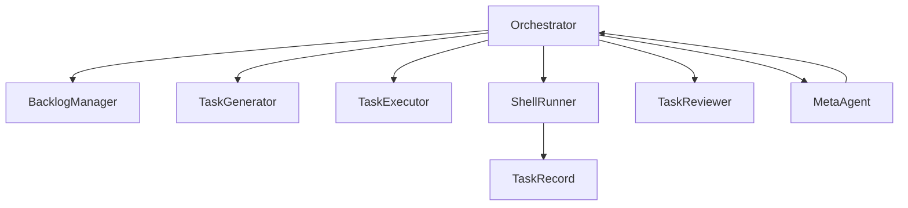

# **CADENCE PLATFORM — NORTH STAR BLUEPRINT**

*Single source of truth for all human and agent contributors.*
*Commit verbatim as `docs/NORTH_STAR.md` and load as root system prompt.*

*Last revised 2025-06-18 (UTC-05:00)*

---

## 1. Mission

> **To industrialize high-quality software delivery through a seamlessly unified, auditable, agentic-human workflow—enabling continuous, self-improving, and transparent execution across diverse projects from ML to infrastructure, at maximum velocity and minimal risk.**

---

## 2. End-State Vision

| Axis                                      | Description                                                                                                                                                     |
| ----------------------------------------- | --------------------------------------------------------------------------------------------------------------------------------------------------------------- |
| **Unified Orchestrator**                  | Central controller with exclusive authority to coordinate all phases; roles fully interchangeable between human and autonomous agents.                          |
| **Agentic Flexibility**                   | Clear interfaces allowing any role (codegen, testing, review, etc.) to seamlessly switch between humans, LLMs, or microservices at runtime without refactoring. |
| **Immutable Auditability**                | Tamper-proof logs of every action, decision, override, and state transition, enabling full historical replay and compliance audits.                             |
| **Continuous Meta-Learning**              | Real-time and periodic meta-agent analyses detect bottlenecks, regressions, technical debt, and policy drift, actively enforcing quality standards.             |
| **Universal Applicability**               | Flexible architecture supporting diverse domains (e.g., REIT, analytics, ML, APIs, operations) without special accommodations or workflow changes.              |
| **Transparent Human-Agent Collaboration** | Complete visibility of rationale, state, and handoffs between human and agent roles, maintaining intuitive interaction and trust.                               |

---

## 3. Strategic Objectives & Key Results (12-month Horizon)

KR1: A fully autonomous agent converts a failing test to green **in safe_inmemory mode** with zero human edits.

| Objective                           | Key Results                                                                                                                           |
| ----------------------------------- | ------------------------------------------------------------------------------------------------------------------------------------- |
| **O1: Launch Robust MVP**           | KR1: Complete one non-trivial end-to-end project delivery (e.g., REIT modeling) with full auditability and agent-human collaboration. |
| **O2: Maximize Velocity**           | KR2: Achieve median task cycle time (selection→commit) ≤1 day; minimum throughput of 5 tasks/week per developer.                      |
| **O3: Ensure Reliability**          | KR3: Zero regressions post-commit; automated gating ensures 100% test pass before merge.                                              |
| **O4: Enable Autonomous Operation** | KR4: Successfully operate at least 3 key workflow phases autonomously per project, logged overrides ≤10%.                             |
| **O5: Continuous Improvement**      | KR5: Real-time analytics on task bottlenecks, rollback frequencies, and failure rates auto-generated and reviewed monthly.            |

---

## 4. Guiding Principles

1. **Explicit Contracts:** Clear boundaries, single responsibilities, documented and enforced interfaces.
2. **Audit by Default:** Immutable records for transparency, compliance, and learning.
3. **Human Empowerment:** Agents augment humans; overrides are explicitly logged, reviewed, and integrated into learning.
4. **No Hidden State:** All state transitions explicit, serialized, and transparent.
5. **Rapid Feedback & Iteration:** Fail fast, surface clearly, and integrate feedback immediately.
6. **Continuous Meta-Optimization:** Meta-process itself is monitored, self-correcting, and prioritized for improvement.

---

## 5. Workflow Phases & Responsibilities

| Phase                                             | Responsibility                                     | Non-negotiable Outputs                 |
| ------------------------------------------------- | -------------------------------------------------- | -------------------------------------- |
| **Backlog** (`BacklogManager`)                    | Manage task lifecycle, prioritization              | Prioritized task queue                 |
| **Generation** (`TaskGenerator`)                  | Task definition, clarity, context alignment        | Validated task objects                 |
| **Execution** (`TaskExecutor`)                    | Create implementable diffs, no direct file edits   | Unified, reviewable diff               |
| **Testing** (`ShellRunner`)                       | Isolated execution of tests, zero side effects     | Test logs, pass/fail                   |
| **Review** (`TaskReviewer`)                       | Audit diff quality, correctness, compliance        | Approval/rejection with rationale      |
| **Commit & Record** (`ShellRunner`, `TaskRecord`) | Persist approved changes, archive state            | Immutable logs and state transitions   |
| **Meta-Review** (`MetaAgent`)                     | Identify workflow improvements, enforce compliance | Actionable improvement reports, alerts |

---

## 6. Audit, Override & Rollback Policy

* All actions explicitly logged with timestamps, rationales, actors.
* Overrides permitted but logged as exceptions with clear rationales.
* Rollbacks documented with prior state and explicit reason.
* No manual edits outside orchestrator without reconciliation.

---

## 7. Agentic Architecture

---

## 8. Metrics Dashboard & Alerts

| Metric Category       | Metrics                                  | Frequency |
| --------------------- | ---------------------------------------- | --------- |
| **Velocity**          | Median task completion cycle time        | Real-time |
| **Quality**           | Test pass rate on first attempt          | Nightly   |
| **Stability**         | Rollback and override rate               | Real-time |
| **Efficiency**        | Bottleneck detection (>24 hours blocked) | Real-time |
| **Agent Integration** | Human-agent role distribution (%)        | Weekly    |

Dashboards include proactive alerts for outliers or policy breaches.

---

## 9. Strategic Roadmap (12-Month)

• **Autonomy Proof (0–1 week)** – mvp_loop.py green run; all subsequent roadmap phases are blocked until this proof succeeds.

| Phase                       | Duration  | Milestones                                   |
| --------------------------- | --------- | -------------------------------------------- |
| **Bootstrap**               | 2 weeks   | MVP orchestrator; initial end-to-end project |
| **Agent Integration**       | +2 weeks  | ≥2 autonomous agent roles operational        |
| **Full Audit & Compliance** | +2 weeks  | Immutable logs; audit replayable state       |
| **Meta Optimization**       | +4 weeks  | Continuous bottleneck analytics active       |
| **Domain Scaling**          | +12 weeks | ≥3 diverse domain implementations            |
| **Autonomous Scaling**      | +12 weeks | Agentic parallel task management             |

---

## 10. Risk Management & Guardrails

| Risk                 | Mitigation                                     |
| -------------------- | ---------------------------------------------- |
| Agent drift          | Automated alerts and mandatory human review    |
| Hidden state         | Strict enforcement of serializable outputs     |
| Workflow skips       | Orchestrator enforces phase sequence           |
| Human override abuse | Overrides logged as exceptions, periodic audit |
| Audit divergence     | Continuous reconciliation and alerting         |

---

## 11. Knowledge Transfer & Leverage Plan

* **Internal Transparency:** Regular auto-generated dev logs.
* **Public Trust:** Whitepapers, case studies, transparency reports.
* **Onboarding & Training:** Recorded workflows, demos, documented procedures.

---

## 12. Glossary & Definitions

| Term           | Definition                                                  |
| -------------- | ----------------------------------------------------------- |
| **Task**       | Serializable JSON object with full state history            |
| **Patch**      | Unified diff representing proposed code changes             |
| **Agent Slot** | Explicitly defined interface, swappable between agent/human |
| **Override**   | Manual intervention with explicit logged rationale          |
| **MetaAgent**  | Analytics system enforcing continuous workflow optimization |

---

**End of Cadence North Star Blueprint**
